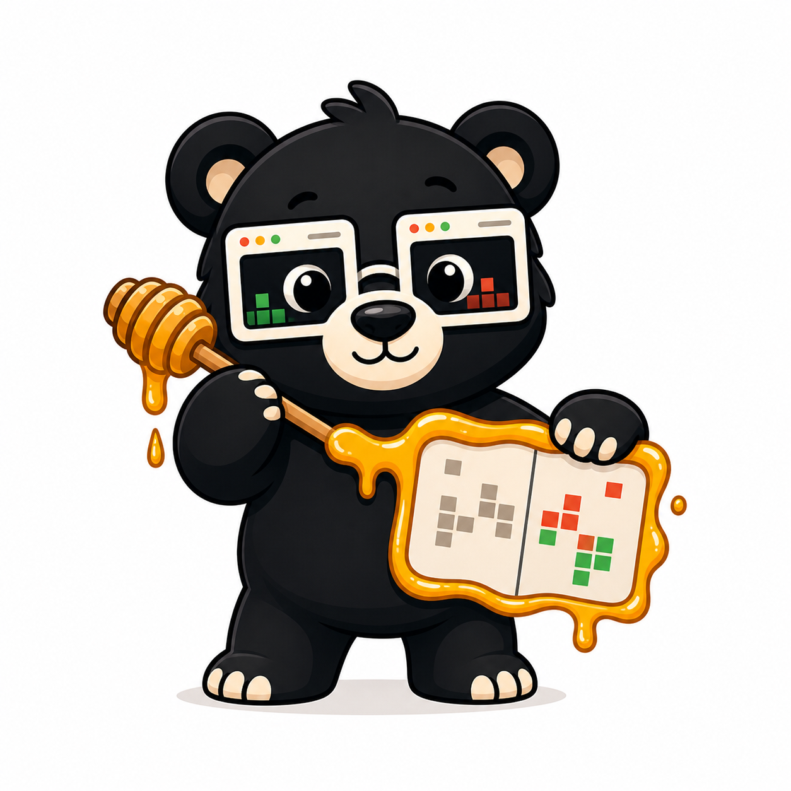

# @vizzly-testing/honeydiff

[](https://www.npmjs.com/package/@vizzly-testing/honeydiff)
[](https://www.npmjs.com/package/@vizzly-testing/honeydiff)
[](https://github.com/vizzly-testing/honeydiff/blob/main/LICENSE)

Fast image comparison for visual regression testing in Node.js.

Honeydiff is a native Rust image diff engine packaged for Node. It is built for
the messy parts of visual testing: anti-aliased text, full-page screenshots,
small rendering noise, diff artifacts, spatial clusters, perceptual metrics, and
accessibility checks.

<p align="center">
  
</p>

```bash
npm install @vizzly-testing/honeydiff
```

Requires Node.js 22+. Prebuilt binaries are included for macOS ARM64, Linux
x64/ARM64, and Windows x64.

## Quick Start

```js
import { compare, quickCompare } from '@vizzly-testing/honeydiff';

let changed = await quickCompare('baseline.png', 'current.png');

if (changed) {
  console.log('Visual change detected');
}

let result = await compare('baseline.png', 'current.png', {
  threshold: 2.0,
  includeClusters: true,
  diffPath: 'artifacts/diff.png',
  maskPath: 'artifacts/mask.png',
  overlayPath: 'artifacts/overlay.png',
  overwrite: true,
});

console.log(result.isDifferent);
console.log(result.diffPercentage);
console.log(result.diffClusters);
```

## Why Honeydiff?

Most image diff packages stop at basic pixel comparison. Honeydiff gives you the
pieces visual regression systems usually need once screenshots get real:

- CIEDE2000 perceptual color thresholds, with `2.0` as the default.
- Strict exact matching when you set `threshold: 0`.
- Conservative anti-aliasing detection for font and sub-pixel rendering noise.
- Variable-height screenshot support for full-page comparisons.
- Diff, mask, and overlay image artifacts for debugging failures.
- Spatial clusters, intensity stats, SSIM, GMSD, and diff fingerprints.
- WCAG contrast checks and color vision deficiency simulation.
- Async and sync APIs with TypeScript definitions included.

## Common Use

### Compare Two Images

```js
import { compare } from '@vizzly-testing/honeydiff';

let result = await compare('before.png', 'after.png', {
  threshold: 2.0,
});

if (result.isDifferent) {
  console.log(`${result.diffPercentage.toFixed(2)}% of pixels changed`);
}
```

### Use Buffers

```js
import { readFile } from 'node:fs/promises';
import { compare } from '@vizzly-testing/honeydiff';

let baseline = await readFile('baseline.png');
let current = await readFile('current.png');

let result = await compare(baseline, current);
```

### Generate Review Artifacts

```js
import { compare } from '@vizzly-testing/honeydiff';

let result = await compare('baseline.png', 'current.png', {
  diffPath: 'artifacts/diff.png',
  maskPath: 'artifacts/mask.png',
  overlayPath: 'artifacts/overlay.png',
  overwrite: true,
});
```

### Group Differences Into Regions

```js
import { compare } from '@vizzly-testing/honeydiff';

let result = await compare('baseline.png', 'current.png', {
  includeClusters: true,
  minClusterSize: 2,
  clusterMerge: true,
});

for (let cluster of result.diffClusters ?? []) {
  console.log(cluster.pixelCount, cluster.boundingBox);
}
```

### Add Perceptual Metrics

```js
import { compare } from '@vizzly-testing/honeydiff';

let result = await compare('baseline.png', 'current.png', {
  includeSSIM: true,
  includeGMSD: true,
});

console.log(result.perceptualScore);
console.log(result.gmsdScore);
```

### Check WCAG Contrast

```js
import { analyzeWcagContrast } from '@vizzly-testing/honeydiff';

let report = await analyzeWcagContrast('screenshot.png');

console.log(report.violations.length);
console.log(report.aaNormalPassPercentage);
console.log(report.violations);
```

### Simulate Color Vision Deficiency

```js
import {
  saveColorBlindnessSimulation,
} from '@vizzly-testing/honeydiff';

await saveColorBlindnessSimulation(
  'screenshot.png',
  'deuteranopia',
  'screenshot-deuteranopia.png'
);
```

## Options

| Option | Default | Notes |
| --- | --- | --- |
| `threshold` | `2.0` | CIEDE2000 Delta E threshold. Use `0` for exact matching. |
| `antialiasing` | `true` | Ignore likely anti-aliased pixels. |
| `maxDiffs` | unlimited | Stop after a maximum number of differing pixels. |
| `includeDiffPixels` | `false` | Return individual differing pixel positions and intensities. |
| `includeClusters` | `false` | Return connected regions of visual change. |
| `minClusterSize` | `2` | Filter tiny isolated clusters as noise. |
| `clusterMerge` | disabled | Merge nearby clusters into logical text-like regions. |
| `includeSSIM` | `false` | Calculate structural similarity. More expensive on large images. |
| `includeGMSD` | `false` | Calculate fast edge-sensitive structural difference. |
| `diffPath` | unset | Save a highlighted diff image. |
| `maskPath` | unset | Save a binary diff mask. |
| `overlayPath` | unset | Save an overlay comparison image. |
| `overwrite` | `false` | Replace existing artifact files. |

## Result Shape

```ts
interface DiffResult {
  isDifferent: boolean;
  diffPercentage: number;
  totalPixels: number;
  diffPixels: number;
  aaPixelsIgnored: number;
  aaPercentage: number;
  boundingBox: BoundingBox | null;
  heightDiff: HeightDiff | null;
  diffPixelsList: DiffPixel[] | null;
  diffClusters: DiffCluster[] | null;
  intensityStats: IntensityStats | null;
  perceptualScore: number | null;
  gmsdScore: number | null;
}
```

See [index.d.ts](./index.d.ts) for the full API surface.

## Thresholds

Honeydiff uses CIEDE2000 Delta E for perceptual color difference.

| Threshold | Meaning |
| --- | --- |
| `0` | Exact pixel matching. |
| `1` | Barely noticeable color changes. |
| `2` | Recommended default for UI screenshots. |
| `3+` | More tolerant of rendering differences. |

The default is intentionally practical for browser and app screenshots: it
filters tiny rendering variance while still catching meaningful UI changes.

## Performance

Current local benchmark snapshots:

| Scenario | Result |
| --- | ---: |
| Full HD default comparison | ~18.9ms |
| Full HD exact comparison | ~2.8ms |
| Identical image fast path | ~0.34ms |
| 4K default comparison | ~76.9ms |
| 4K exact comparison | ~14.0ms |

See [benchmarks/BENCHMARK_RESULTS.md](https://github.com/vizzly-testing/honeydiff/blob/main/benchmarks/BENCHMARK_RESULTS.md)
for the current benchmark notes.

## API Overview

```js
import {
  analyzeWcagAllCvd,
  analyzeWcagContrast,
  analyzeWcagForCvd,
  compare,
  compareSync,
  computeFingerprintSync,
  fingerprintHashSync,
  fingerprintSimilaritySync,
  getColorBlindnessTypes,
  getDimensions,
  getDimensionsSync,
  getImageMetadata,
  getImageMetadataFromFile,
  getImageMetadataFromFileSync,
  getImageMetadataSync,
  quickCompare,
  quickCompareSync,
  saveAllColorBlindnessSimulations,
  saveColorBlindnessSimulation,
  saveWcagOverlay,
  simulateColorBlindness,
} from '@vizzly-testing/honeydiff';
```

## Development

```bash
pnpm install
cargo build --release
cargo test
```

The package is ESM-first and ships native binaries through optional platform
packages.

## License

MIT
